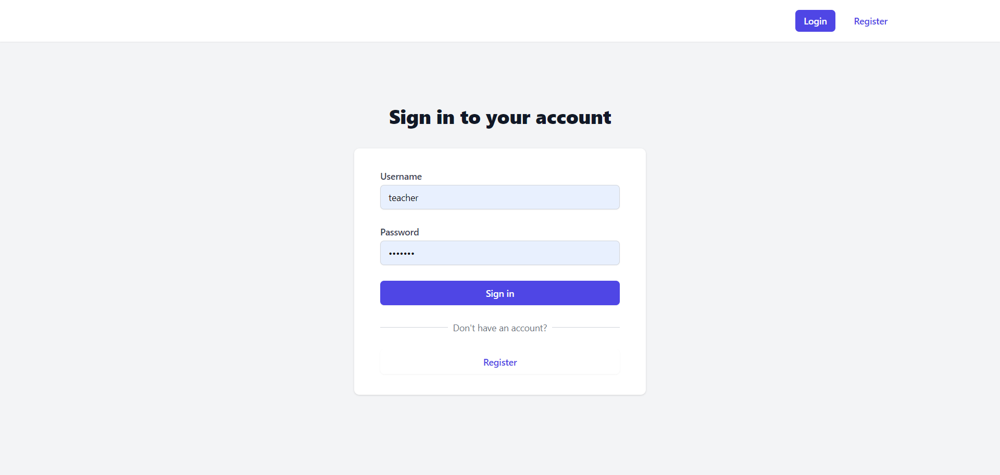
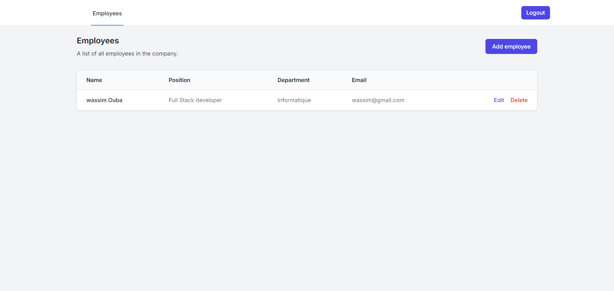
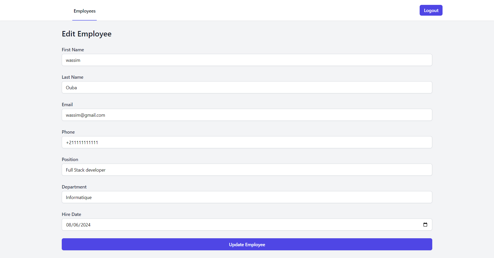

# Employee Management System


## Description

The Employee Management System is a web-based application designed to streamline the process of managing employee information, attendance, and performance within an organization. This system provides an intuitive interface for HR personnel and managers to efficiently handle various aspects of employee management.

## Features

- User Authentication (Login/Register)
- Employee Directory
- Attendance Tracking
- Performance Management
- Leave Management
- Reporting and Analytics

## Screenshots

### Login Page



### Dashboard



### Employee Directory



## Technologies Used

- Frontend:

  - React.js
  - Next.js
  - Tailwind CSS

- Backend:

  - Node.js
  - Next.js

- Database:

  - MongoDB

- Authentication:

  - JSON Web Tokens (JWT)

- Other Libraries:
  - bcrypt.js (for password hashing)

## Setup and Installation

1. Clone the repository:

   ```
   git clone https://github.com/wassimOubaziz/PRODIGY_FS_02.git
   ```

2. Navigate to the project directory:

   ```
   cd employee-management-system
   ```

3. Install dependencies:

   ```
   npm install
   ```

4. Set up environment variables:
   Create a `.env` file in the root directory and add the following:
   `    MONGODB_URI=your_mongodb_connection_string
    JWT_SECRET=your_jwt_secret_key
   `

5. Run the development server:

   ```
   npm run dev
   ```

6. Open your browser and visit `http://localhost:3000`

## Usage

1. Register a new account or log in with existing credentials.
2. Navigate through the dashboard to access various features.
3. Use the employee directory to view and manage employee information.
4. Track attendance and manage leave requests.
5. Generate reports and analyze employee performance.

## Contributing

Contributions are welcome! Please feel free to submit a Pull Request.

## License

This project is licensed under the [MIT License](LICENSE).

## Contact

Wassim Oubaziz - [LinkedIn](https://www.linkedin.com/in/wassim-oubaziz/)

Project Link: [https://github.com/wassimOubaziz/PRODIGY_FS_02](https://github.com/wassimOubaziz/PRODIGY_FS_02)
